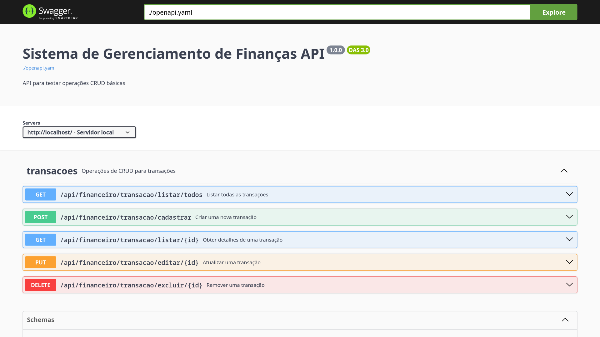
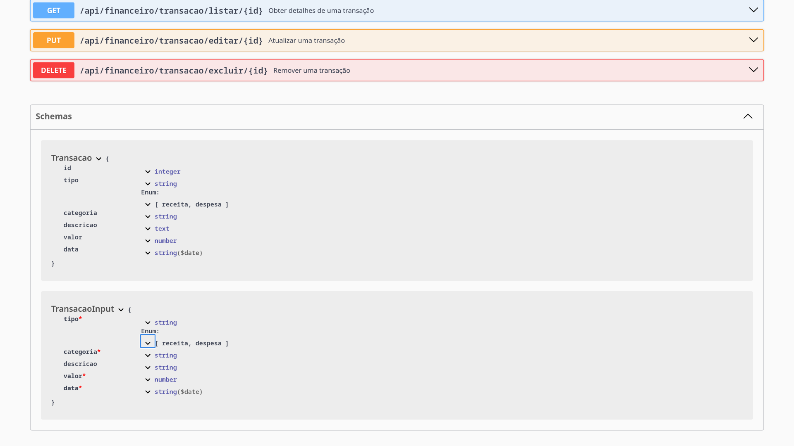

# Imagens

<!-- Substitua o caminho acima pelo caminho real da sua imagem -->

# Tecnologias
- Laravel v12.x
- PHP v8.4.x
- MySQL v8.1.x (default)
- Mailpit v1.x
- Node.js v18.x
- NPM v10.x
- Redis v7.2.x
- Swagger UI
- Docker

# Descrição
Esta aplicação é destinada à construção de uma API que realiza operações básicas de CRUD (Create, Read, Update, Delete), possibilitando a criação, atualização, remoção e exclusão de registros. Adicionalmente, a API permite a consulta individualizada de cada registro no sistema.

A API consiste em um sistema de gerenciamento financeiro, com capacidade para categorizar diferentes tipos de transações, sejam elas receitas ou despesas.

# Como instalar
**Obs:** Como pré-requisito precisa de ter o docker e docker compose instalado.

- `git clone https://github.com/refactorian/laravel-docker.git`
- `cd laravel-docker`
- `docker compose up -d --build`
- `docker compose exec -it [container] bash`

### Laravel App
- URL: http://localhost

### Mailpit
- URL: http://localhost:8025

### Swagger UI
- URL: http://localhost:8090

### Adminer
- URL: http://localhost:9090
- Servidor: `db`
- Usuário: `laravel`
- Senha: `secret`
- Banco de Dados: `laravel`

### Comandos básicos docker
- Construir ou reconstruir serviços
    - `docker compose build`
- Criar e iniciar contêineres
    - `docker compose up -d`
- Parar e remover contêineres, redes
    - `docker compose down`
- Parar todos os serviços
    - `docker compose stop`
- Reiniciar contêineres de serviço
    - `docker compose restart`
- Executar um comando dentro de um contêiner
    - `docker compose exec [container] [command]`

### Comandos artisan
- Exibir informações básicas sobre sua aplicação
    - `php artisan about`
- Remover o arquivo de cache de configuração
    - `php artisan config:clear`
- Limpar o cache da aplicação
    - `php artisan cache:clear`
- Limpar todos os eventos e listeners em cache
    - `php artisan event:clear`
- Excluir todos os jobs da fila especificada
    - `php artisan queue:clear`
- Remover o arquivo de cache de rotas
    - `php artisan route:clear`
- Limpar todos os arquivos de visualização compilados
    - `php artisan view:clear`
- Remover o arquivo de classe compilado
    - `php artisan clear-compiled`
- Remover os arquivos de bootstrap em cache
    - `php artisan optimize:clear`
- Excluir os arquivos mutex em cache criados pelo agendador
    - `php artisan schedule:clear-cache`
- Limpar tokens expirados de redefinição de senha
    - `php artisan auth:clear-resets`